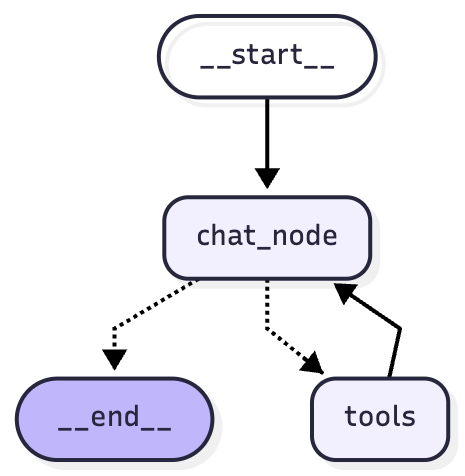

# Trip Planner AI

An intelligent travel planning assistant powered by LangGraph and LangChain that helps users plan complete trips using AI-powered tools and real-time data.

---

## 🎥 Project Walkthrough

Watch the complete project walkthrough to see the Agentic Chatbot in action:

[](https://youtu.be/mw7kImMa-bc)

*Click the image above to watch the full walkthrough on YouTube*

---

## Features

- **Conversational Trip Planning** - Natural language interface for planning trips
- **Multi-Tool Integration** - Searches flights, hotels, weather, attractions, and travel vlogs
- **AI-Powered Search** - Google AI Mode integration for curated travel information
- **Real-Time Data** - Live flight prices, hotel availability, and weather forecasts
- **Intelligent Orchestration** - LLM decides which tools to use based on user needs
- **Persistent Conversations** - Chat history saved with thread-based memory
- **Transparent Tool Execution** - See which tools are called and what data is retrieved

## Architecture

### Tech Stack
- **LangGraph** - Workflow orchestration and state management
- **LangChain** - LLM framework and tool integration
- **Streamlit** - Interactive web UI
- **OpenAI GPT** - Conversational AI and reasoning
- **SerpAPI** - Google Flights, Hotels, Maps, YouTube data
- **OpenWeather API** - Weather forecasts
- **SQLite** - Conversation persistence

### Components

```
travel-agent-v2/
├── backend.py      # LangGraph agent workflow
├── frontend.py     # Streamlit UI
├── tools.py        # Tool implementations
├── prompts.py      # System prompts
└── .env           # API keys
```

## Installation

### Prerequisites
- Python 3.8+
- OpenAI API key
- SerpAPI key
- OpenWeather API key

### Setup

1. **Clone the repository**
```bash
cd travel-agent-v2
```

2. **Create virtual environment**
```bash
python -m venv .venv
source .venv/bin/activate  # On Windows: .venv\Scripts\activate
```

3. **Install dependencies**
```bash
pip install -r requirements.txt
```

4. **Configure environment variables**

Create a `.env` file in the project root:

```env
# Required API Keys
OPENAI_API_KEY=your_openai_api_key_here
SERPAPI_API_KEY=your_serpapi_key_here
OPENWEATHER_API_KEY=your_openweather_key_here

# Optional
CACHE_DIR=./cache
```

**Get API Keys:**
- OpenAI: https://platform.openai.com/api-keys
- SerpAPI: https://serpapi.com/manage-api-key
- OpenWeather: https://home.openweathermap.org/api_keys

## Usage

### Run the Application

```bash
streamlit run frontend.py
```

The app will open in your browser at `http://localhost:8501`

### Example Conversations

**Simple Trip Planning:**
```
User: I want to plan a trip to Paris
Agent: I'd be happy to help! To plan your Paris trip, I need a few details:
        - Where will you be traveling from?
        - What dates are you considering?
        - What's your approximate budget?
        - How many travelers?
```

**Complete Trip Request:**
```
User: Plan a 5-day trip to Tokyo from NYC, departing June 1st,
      budget $3000, 2 adults

Agent: [Uses tools: search_flights, search_hotels, search_weather,
        search_attractions, search_youtube_vlogs]

        [Generates complete itinerary with flights, hotels, daily
        activities, weather info, and budget breakdown]
```

**General Travel Questions:**
```
User: What are the best months to visit Bali?

Agent: [Uses google_search tool to get AI-curated travel advice]
```

## Available Tools

The agent has access to these tools:

| Tool | Purpose | Data Source |
|------|---------|-------------|
| `search_flights` | Find flight options with prices | Google Flights (SerpAPI) |
| `search_hotels` | Find hotel accommodations | Google Hotels (SerpAPI) |
| `search_weather` | Get weather forecasts | OpenWeather API |
| `search_attractions` | Find places to visit | Google Maps (SerpAPI) |
| `search_youtube_vlogs` | Find travel vlogs/guides | YouTube (SerpAPI) |
| `google_search` | AI-curated web search | Google AI Mode (SerpAPI) |
| `calculator` | Basic arithmetic | Built-in |

## How It Works

1. **User Input** - User asks about trip planning
2. **Clarification** - Agent asks for missing information (dates, budget, etc.)
3. **Tool Selection** - LLM decides which tools to call based on needs
4. **Data Gathering** - Tools fetch real-time data from APIs
5. **Itinerary Generation** - Agent creates comprehensive day-by-day plan
6. **Budget Breakdown** - Provides cost estimates and recommendations

### LangGraph Workflow

```
START -> chat_node -> [tools_condition]
            ^              |
            |              v
            +---- tools <--+
```

- **chat_node**: LLM processes messages and decides actions
- **tools**: Executes selected tools
- **tools_condition**: Routes to tools if needed, or ends if done

## Graph Architecture

The following diagram illustrates the LangGraph workflow architecture:



**Workflow Components:**

- **`__start__`**: Entry point of the workflow
- **`chat_node`**: Core conversational AI that processes user messages and decides actions
- **`tools`**: Executes external tools (flights, hotels, weather, etc.) based on LLM decisions
- **`__end__`**: Termination point when conversation is complete

**Flow Description:**
1. Workflow begins at `__start__` and proceeds to `chat_node`
2. `chat_node` analyzes the user input and decides whether to:
   - End the conversation (route to `__end__`)
   - Use tools to gather information (route to `tools`)
3. If tools are needed, `tools` executes the selected tool(s)
4. After tool execution, control returns to `chat_node` for further processing
5. This creates an iterative loop allowing the agent to use multiple tools and continue the conversation

The dotted arrows represent conditional transitions based on the LLM's decision-making, while solid arrows show the standard flow path.

## Features in Detail

### Conversation Memory
- Each conversation has a unique thread ID
- Chat history persisted in SQLite database
- Switch between conversations in sidebar
- Create new chats anytime

### Tool Execution Transparency
- Status container shows which tools are running
- View parameters passed to each tool
- See result summaries (e.g., "Found 10 flights")
- Expandable logs for full transparency

### Intelligent Tool Usage
The agent intelligently decides:
- Skip flight search if user already booked
- Skip hotel search if accommodation arranged
- Always check weather for planning
- Find attractions based on interests
- Search vlogs for inspiration

### Caching
- API responses cached for 6 hours
- Reduces API costs and latency
- Automatic cache invalidation

## Configuration

### Customize System Prompt
Edit `prompts.py` to modify agent behavior:
```python
TRIP_PLANNER_SYSTEM_PROMPT = """
Your custom instructions here...
"""
```

### Add New Tools
1. Define tool in `tools.py` with `@tool` decorator
2. Add to `ALL_TOOLS` list
3. Tool automatically available to agent

### Adjust LLM Model
Edit `backend.py`:
```python
llm = ChatOpenAI(model="gpt-4")  # or gpt-3.5-turbo, gpt-4o, etc.
```

## Project Structure

```
travel-agent-v2/
├── backend.py          # LangGraph agent graph definition
├── frontend.py         # Streamlit UI with chat interface
├── tools.py           # Tool implementations (@tool decorated)
├── prompts.py         # System prompt configuration
├── requirements.txt   # Python dependencies
├── .env              # API keys (not committed)
├── .gitignore        # Git ignore rules
├── cache/            # API response cache (auto-created)
├── chatbot.db        # SQLite conversation store (auto-created)
└── README.md         # This file
```

## Troubleshooting

### API Key Errors
```
Error: SERPAPI_API_KEY not found in environment
```
**Solution:** Ensure `.env` file exists with valid API keys

### Import Errors
```
ModuleNotFoundError: No module named 'langgraph'
```
**Solution:** Install dependencies: `pip install -r requirements.txt`

### Database Locked
```
sqlite3.OperationalError: database is locked
```
**Solution:** Close other instances of the app accessing `chatbot.db`

### Tool Errors
Check logs in terminal for detailed error messages. Common issues:
- Invalid API keys
- Rate limits exceeded
- Invalid date formats (use YYYY-MM-DD)
- Missing required parameters

## Development

### Running Tests
```bash
# Test individual tools
python -c "from tools import search_flights; print(search_flights('NYC', 'LAX', '2025-07-01'))"
```

### Debug Mode
Add to `backend.py` for verbose logging:
```python
import logging
logging.basicConfig(level=logging.DEBUG)
```

### View Graph
```python
from backend import chatbot
chatbot.get_graph().print_ascii()
```

## Future Enhancements

- [ ] Multi-city trip planning
- [ ] Budget optimization algorithms
- [ ] Restaurant recommendations
- [ ] Travel visa requirements
- [ ] Currency conversion
- [ ] Collaborative trip planning (multiple users)
- [ ] Export itinerary to PDF/Calendar
- [ ] Integration with booking platforms

## License

MIT License - Feel free to use and modify for your projects.

## Contributing

Contributions welcome! Please:
1. Fork the repository
2. Create a feature branch
3. Make your changes
4. Submit a pull request

## Support

For issues or questions:
- Check the troubleshooting section
- Review API documentation (SerpAPI, OpenWeather)
- Open an issue on GitHub

## Acknowledgments

- **LangChain** - LLM application framework
- **LangGraph** - Workflow orchestration
- **SerpAPI** - Real-time search data
- **OpenAI** - Conversational AI
- **Streamlit** - Rapid UI development

---

Built with LangGraph and LangChain
