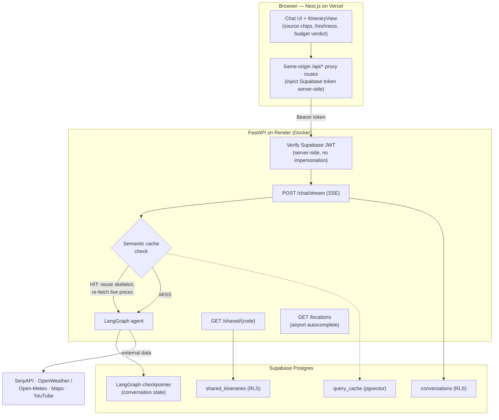
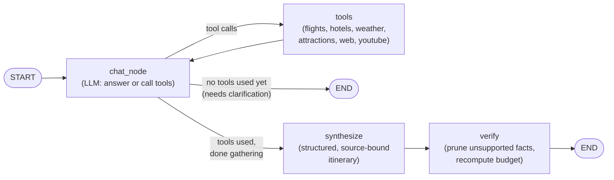
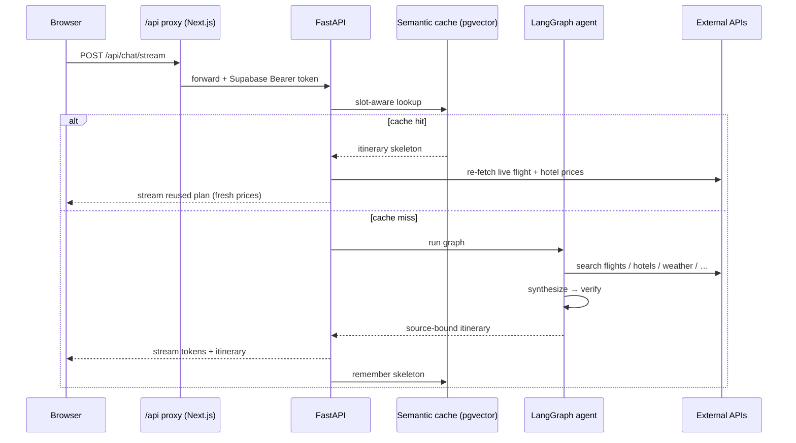

# Trip Planner

A LangGraph trip-planning agent behind a FastAPI streaming API, with a Next.js
frontend and Supabase (Postgres + auth + pgvector).

The premise is **a plan you can trust**. Every price, flight, and hotel shows where
it came from and how fresh it is; facts the tools didn't actually return are dropped
rather than guessed; and anything checkable — the budget total, currency conversion,
weather labelling, airport codes — is computed in code instead of being taken on the
model's word.

---

## Demo

<!-- Add the walkthrough video / GIF here. -->

_Walkthrough coming soon._

---

## What it does

- **Conversational planning.** Describe a trip in plain language (or the structured
  form); the agent asks for what's missing, then gathers flights, hotels, weather,
  attractions, and reference vlogs.
- **Source-bound itinerary.** Each flight, hotel, and weather line carries a
  `source_tool` and a `retrieved_at` timestamp, surfaced in the UI as source chips
  and an "as of" freshness note.
- **Deterministic budget.** The total is `cheapest flight × travelers + cheapest
  hotel × nights`, computed in code, shown in the user's currency via a live FX rate,
  with an over/under verdict against their cap.
- **Verified, not hallucinated.** A verifier prunes any price or name not present in
  the tool output; a pruned category becomes an honest disclaimer instead of a made-up
  answer.
- **Shareable.** Any itinerary can be frozen to a public, login-free `/i/<code>` page
  with an OG preview.
- **Cheap on repeats.** A slot-aware semantic cache reuses the stable itinerary
  skeleton for near-identical requests while always re-fetching live prices — so a
  cache hit is fast but never stale.

## Tech stack

| Layer | Choice |
|---|---|
| Agent | LangGraph + LangChain, OpenAI models |
| API | FastAPI, Server-Sent Events (streaming) |
| Frontend | Next.js (App Router), Tailwind, shadcn |
| Data | Supabase — Postgres, auth, pgvector |
| External | SerpAPI (flights/hotels/maps/YouTube), OpenWeather + Open-Meteo (weather), airportsdata (offline IATA), open.er-api.com (FX) |
| Ops | Docker + Render (API), Vercel (frontend), LangSmith (tracing), GitHub Actions (CI) |

---

## Architecture


```mermaid
flowchart TB
    subgraph Client["Browser — Next.js on Vercel"]
        UI["Chat UI + ItineraryView<br/>(source chips, freshness, budget verdict)"]
        Proxy["Same-origin /api/* proxy routes<br/>(inject Supabase token server-side)"]
        UI --> Proxy
    end

    subgraph API["FastAPI on Render (Docker)"]
        Auth["Verify Supabase JWT<br/>(server-side, no impersonation)"]
        Stream["POST /chat/stream (SSE)"]
        Cache{"Semantic cache<br/>check"}
        Graph["LangGraph agent"]
        Share["GET /shared/{code}"]
        Loc["GET /locations<br/>(airport autocomplete)"]
        Auth --> Stream --> Cache
    end

    subgraph DB["Supabase Postgres"]
        CP["LangGraph checkpointer<br/>(conversation state)"]
        Conv["conversations (RLS)"]
        Shared["shared_itineraries (RLS)"]
        QC["query_cache (pgvector)"]
    end

    Proxy -->|"Bearer token"| Auth
    Cache -->|"HIT: reuse skeleton,<br/>re-fetch live prices"| Graph
    Cache -->|"MISS"| Graph
    Graph --> CP
    Stream --> Conv
    Share --> Shared
    Cache -.-> QC
    Graph -->|"external data"| Ext["SerpAPI · OpenWeather /<br/>Open-Meteo · Maps · YouTube"]
```

The through-line is reliability. The frontend never holds a backend token — the
browser calls same-origin proxy routes (`/api/chat/stream`, `/api/share`,
`/api/locations`) that attach the Supabase session token server-side, so there's no
client secret and no CORS. Row-level security scopes every user to their own
conversations and shares.

### The agent graph


```mermaid
flowchart LR
    START([START]) --> chat["chat_node<br/>(LLM: answer or call tools)"]
    chat -->|tool calls| tools["tools<br/>(flights, hotels, weather,<br/>attractions, web, youtube)"]
    tools --> chat
    chat -->|"no tools used yet<br/>(needs clarification)"| END1([END])
    chat -->|"tools used,<br/>done gathering"| synth["synthesize<br/>(structured, source-bound<br/>itinerary)"]
    synth --> verify["verify<br/>(prune unsupported facts,<br/>recompute budget)"]
    verify --> END2([END])
```

- **chat_node** — the LLM either asks a clarifying question, calls tools, or signals
  it's done. This is the ReAct loop; it can call tools multiple times.
- **synthesize** — once tools have run, a structured-output model turns the gathered
  data into an `Itinerary`. Currency, weather labels, and the budget are then
  overwritten by code, never trusted from the model.
- **verify** — a value verifier removes any fact whose price/name isn't backed by the
  tool output, re-computes the budget on what survives, and records what it dropped.

### A request, end to end


```mermaid
sequenceDiagram
    participant U as Browser
    participant P as /api proxy (Next.js)
    participant A as FastAPI
    participant C as Semantic cache (pgvector)
    participant G as LangGraph agent
    participant X as External APIs

    U->>P: POST /api/chat/stream
    P->>A: forward + Supabase Bearer token
    A->>C: slot-aware lookup
    alt cache hit
        C-->>A: itinerary skeleton
        A->>X: re-fetch live flight + hotel prices
        A-->>U: stream reused plan (fresh prices)
    else cache miss
        A->>G: run graph
        G->>X: search flights / hotels / weather / …
        G->>G: synthesize → verify
        G-->>A: source-bound itinerary
        A-->>U: stream tokens + itinerary
        A->>C: remember skeleton
    end
```

Deeper design notes and the file map live in
[`docs/architecture.md`](docs/architecture.md). The full reliability roadmap and
decisions are in [`plan-v2.md`](plan-v2.md).

---

## Tools

The agent has access to these tools; the LLM decides which to call.

| Tool | Purpose | Source |
|---|---|---|
| `search_flights` | Flight options with prices | Google Flights (SerpAPI) |
| `search_hotels` | Hotels with nightly rates | Google Hotels (SerpAPI) |
| `search_weather` | Forecast or seasonal norms, labelled | OpenWeather + Open-Meteo |
| `search_attractions` | Things to do | Google Maps (SerpAPI) |
| `search_youtube_vlogs` | Reference vlogs / guides | YouTube (SerpAPI) |
| `google_search` | Curated web answer | Google AI Mode (SerpAPI) |

Tool output is validated, freshness-stamped, and neutralized against prompt
injection before it reaches the model. Prices are always requested in USD and
converted for display; airport codes are resolved offline from `airportsdata`.

---

## Running locally

### Prerequisites
- Python 3.12
- Node 20+ and `pnpm`
- A Supabase project (URL, publishable key, secret key, session-pooler DB URL)
- API keys: OpenAI, SerpAPI, OpenWeather (LangSmith optional)

### Backend (FastAPI agent)

```bash
python -m venv .venv
source .venv/bin/activate
pip install -r requirements.txt
```

Copy `.env.example` to `.env` and fill in your keys, then apply the database
migrations once against your Supabase project:

```bash
for f in supabase/migrations/*.sql; do psql "$DATABASE_POOLED_URL" -f "$f"; done
```

Run the API:

```bash
uvicorn api.main:app --reload --port 8000
```

Health check: `http://localhost:8000/readyz` should return `{"status":"ready"}`.

### Frontend (Next.js)

```bash
cd frontend
pnpm install
pnpm dev
```

Set the frontend environment variables (`NEXT_PUBLIC_SUPABASE_URL`,
`NEXT_PUBLIC_SUPABASE_PUBLISHABLE_KEY`, and `API_URL` pointing at the backend). The
app runs at `http://localhost:3000`.

---

## Deployment

The API deploys to Render as a Docker service (`Dockerfile` + `render.yaml`, binding
`$PORT`); the frontend deploys to Vercel with root directory `frontend`. Both talk to
the same Supabase project. Step-by-step instructions — env vars, migrations, CORS,
and the Supabase auth redirect config — are in [`docs/deploy.md`](docs/deploy.md).

CI (`.github/workflows/ci.yml`) runs the network-free backend tests and the frontend
typecheck/lint on every pull request.

---

## Project layout

```
travel-agent-v2/
├── backend.py            # LangGraph agent graph (chat → tools → synthesize → verify)
├── prompts.py            # System + synthesis prompts
├── tools.py              # Tool implementations (validated, freshness-stamped, fenced)
├── schema.py             # Itinerary data model
├── compute.py  fx.py     # Deterministic budget + live currency conversion
├── verifier.py           # Prunes unsupported facts (abstention)
├── enrich.py             # Attaches booking / map links to verified facts
├── locations.py          # Offline airport (IATA) resolution + autocomplete
├── cache.py              # Slot-aware semantic response cache (pgvector)
├── observability.py      # LangSmith tracing + token/cost accounting
├── settings.py           # Validated settings (no import-time side effects)
├── api/                  # FastAPI app: main, auth, db, streaming, schemas
├── supabase/migrations/  # conversations, shared_itineraries, query_cache
├── frontend/             # Next.js App Router app
├── evals/                # Offline evaluation suite
└── docs/                 # architecture.md, deploy.md
```

---

## License

MIT.
